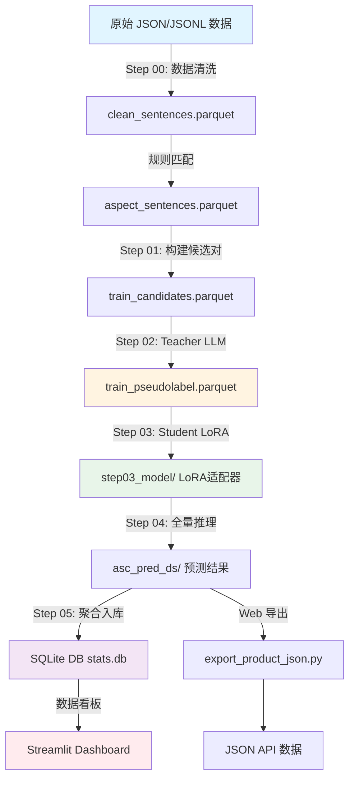

# 🚀 ABSA 细粒度情感分析系统

> **基于 Teacher-Student 知识蒸馏的低成本、高性能情感分析解决方案**

[](https://www.python.org/)
[](https://streamlit.io/)
[](https://pytorch.org/)
[](LICENSE)

---

## 📖 项目简介

### 痛点分析

在电商评论情感分析场景中，传统方案面临两大核心挑战：

1. **💰 成本高昂**：直接使用 LLM API（如 GPT-4）分析百万级评论，成本可达 **$150/百万条**
2. **❄️ 冷启动困难**：从零训练小模型需要大量人工标注数据，标注成本高、周期长

### 解决方案：知识蒸馏架构

本项目采用 **Teacher-Student 知识蒸馏**架构，实现**低成本、高性能**的情感分析：

| 方案 | 成本（百万条） | 性能 | 适用场景 |
|------|---------------|------|---------|
| **Full LLM API** | ~$150 | ⭐⭐⭐⭐⭐ | 小规模数据 |
| **本项目（蒸馏）** | **~$0.15** | ⭐⭐⭐⭐ | **大规模生产** |

**核心优势**：
- ✅ **成本降低**：仅对训练样本（5K-20K）调用 LLM API，全量推理使用本地 LoRA 模型
- ✅ **性能接近 Teacher**：LoRA 模型在特定领域上接近大模型性能
- ✅ **流式推理**：支持大量数据的高效处理，内存占用低
- ✅ **混合存储**：Parquet（列式存储）+ SQLite（快速查询）的混合架构

---

## 🏗️ 技术架构

### 系统流程图



### 核心技术栈

| 组件 | 技术选型 | 优势 |
|------|---------|------|
| **数据存储** | Parquet + DuckDB + SQLite | 列式存储、高效聚合、快速查询 |
| **模型框架** | PyTorch + Transformers | 生态成熟、LoRA 支持完善 |
| **基座模型** | `hfl/chinese-macbert-base` | 中文优化、参数量适中（110M） |
| **微调策略** | LoRA (Low-Rank Adaptation) | 参数量 <1%、训练快、显存占用低 |
| **Web UI** | Streamlit | 快速原型、交互友好、实时进度 |
| **规则匹配** | FlashText | O(n) 时间复杂度、支持大规模词表 |

---

## ⚡ 快速开始

### 前置要求

- Python 3.8+
- (可选) NVIDIA GPU + CUDA（用于模型训练和推理加速）
- (可选) Conda（推荐用于环境管理）

### 安装步骤

#### 1. 克隆仓库

```bash
git clone https://github.com/your-username/ABSA.git
cd ABSA
```

#### 2. 创建 Conda 环境（推荐）

```bash
# 创建环境
conda create -n absa python=3.10 -y
conda activate absa

# 安装依赖
pip install -r requirements.txt
```

#### 3. 安装 PyTorch（GPU 支持）

```bash
# CUDA 11.8 (Windows/Linux)
pip install torch torchvision torchaudio --index-url https://download.pytorch.org/whl/cu118

# CPU 版本
pip install torch torchvision torchaudio
```

#### 4. 启动 Web UI 🎉

```bash
streamlit run app.py
```

**就这么简单！** 浏览器会自动打开 `http://localhost:8501`，您将看到一个功能完整的可视化界面。

> 💡 **提示**：所有操作都可以通过 Web UI 完成，无需记忆复杂的命令行参数。

---

## 📚 详细使用指南

### 工作流程概览

本系统采用**五步流水线**设计，每一步都有清晰的输入输出和可视化界面：

```
Step 0: 数据清洗 (Ingest)
  ↓
Step 1: 规则匹配 & 覆盖率检查
  ↓
Step 2: 知识蒸馏 (Teacher 生成伪标签)
  ↓
Step 3: 模型训练 (Student LoRA)
  ↓
Step 4: 全量推理 & 数据库入库
  ↓
Step 5: 数据看板可视化
```

### Step 0: 数据清洗 (Ingest)

**目标**：将原始 JSON/JSONL 数据清洗并切句，生成标准化的句子级数据。

**操作步骤**：
1. 在 Web UI 侧边栏选择**领域**（如 `phone`）和**任务标识**（如 `prod_v1_full`）
2. 进入 **"0️⃣ 数据准备"** 页面
3. 将原始数据放入 `workspace_data/inputs/<domain>/<brand>/<model>/` 目录
4. 点击 **"▶️ 开始清洗 (Run Step 00)"**
5. 查看结果预览（清洗后的语料数量）

**输出**：`outputs/<domain>/clean_sentences.parquet`

**数据格式要求**：
- 支持 JSON/JSONL 格式
- 自动识别内容字段：`content` / `text` / `comment` / `review` / `body` / `评价内容`
- 自动识别时间字段：`ctime` / `create_time` / `comment_time` 等

### Step 1: 规则匹配 & 覆盖率检查

**目标**：使用规则词典匹配方面词，计算覆盖率，并优化词表。

**操作步骤**：
1. 进入 **"1️⃣ 覆盖率实验室"** 页面
2. **规则匹配**：
   - 确认配置文件存在（`configs/domains/<domain>/aspects.yaml`）
   - 点击 **"▶️ 运行规则匹配"**
3. **效果分析**：
   - 点击 **"📊 开始分析覆盖率"**
   - 查看覆盖率指标（目标 >50%）
   - 查看未覆盖样本和智能建议
4. **AI 规则进化**（可选）：
   - 点击 **"🤖 1. AI 智能分析"** 获取词表优化建议
   - 预览变更后点击 **"✅ 2. 确认并应用"**

**输出**：
- `outputs/<domain>/aspect_sentences.parquet`（标注了方面词的句子）
- `outputs/<domain>/aspect_coverage_<domain>.xlsx`（覆盖率报表）

### Step 2: 知识蒸馏 - Teacher 生成伪标签

**目标**：使用 LLM API 为训练候选对生成高质量伪标签。

**操作步骤**：
1. 在侧边栏配置 **LLM 模型**（支持 OpenAI、DeepSeek、Moonshot、阿里云等）
2. 进入 **"2️⃣ 训练与推理"** → **"🧠 Step 02: 伪标签 (API)"** 标签页
3. 设置参数：
   - **采样数量**：测试建议 100-500，生产建议 2000+
   - **API 批次**：默认 10
4. 点击 **"🚀 运行 Step 02 (生成数据)"**
5. 查看成本估算（通常 <$0.01）

**输出**：`outputs/<domain>/runs/<run_id>/step02_pseudo/train_pseudolabel.parquet`

> 💡 **成本优势**：此步骤仅对训练样本调用 API，成本极低。例如 2000 条样本 ≈ $0.0003。

### Step 3: 模型训练 - Student LoRA

**目标**：使用伪标签训练轻量级 LoRA 模型。

**操作步骤**：
1. 进入 **"2️⃣ 训练与推理"** → **"🔥 Step 03: 训练 (GPU)"** 标签页
2. **参数设置**：
   - **基座模型**：推荐 `hfl/chinese-macbert-base`
   - **Batch Size**：1-16（根据显存调整，笔记本建议 4）
   - **Grad Accum**：1-16（等效 Batch Size = Batch Size × Grad Accum）
   - **Epochs**：默认 3
3. **执行操作**：
   - 如果检测到旧存档，可选择 **"▶️ 继续训练 (Resume)"**
   - 否则点击 **"🔥 开始新训练 (Start)"**

**输出**：`outputs/<domain>/runs/<run_id>/step03_model/`（LoRA 适配器权重）

> ⚠️ **注意事项**：此步骤会满载显卡，笔记本用户建议降低 Batch Size 并启用散热模式。

### Step 4: 全量推理 & 数据库入库

**目标**：使用训练好的模型对全量数据进行情感预测，并聚合到 SQLite 数据库。

**操作步骤**：
1. 进入 **"2️⃣ 训练与推理"** → **"🔎 Step 04: 验证 (推理)"** 标签页
2. **模型路径**：自动填充或手动输入
3. **性能与散热设置**：
   - **推理 Batch Size**：4-128（笔记本建议 8-16）
   - **开启"散热喘息"模式**：每批次计算后暂停 0.5 秒，防止显卡过热
4. 选择执行方式：
   - **⚡ 重新推理 (清除旧数据)**：从头开始
   - **▶️ 继续推理 (断点续传)**：从上次中断处继续

**输出**：
- `outputs/<domain>/runs/<run_id>/step04_pred/asc_pred_ds/`（分片预测结果，Parquet 格式）
- `outputs/<domain>/runs/<run_id>/step05_agg/`（聚合 Excel 报表）

### Step 5: 数据看板可视化

**目标**：在 Streamlit Dashboard 中可视化分析结果。

**操作步骤**：
1. 进入 **"3️⃣ 数据看板 (DB版)"** 页面
2. **数据同步**（首次使用）：
   - 点击 **"🚀 聚合最新结果入库"**，将 Parquet 数据聚合到 SQLite
3. **筛选与可视化**：
   - 选择品牌和型号
   - 查看核心指标（总声量、正面率、负面率、NPS）
   - 浏览可视化图表：
     - 🥧 总体情感占比（饼图）
     - ☀️ 各方面正负面分布（旭日图）
     - 🎭 正/负面评价的具体构成（饼图）
     - 📊 各方面情感比例对比（堆叠条形图）
     - 📅 声量与情感趋势（时间序列图）
     - 🚨 Top 10 负面关注点（横向条形图）

**数据库优势**：
- **快速查询**：SQLite 支持复杂筛选和聚合
- **实时更新**：支持增量入库，无需重新计算全量数据
- **混合存储**：Parquet（列式存储，高效聚合）+ SQLite（快速查询，支持多维度筛选）

---

## 🔌 API 集成

### Web 数据导出

系统提供了 Web 友好的 JSON 数据导出功能，方便外部网站集成。

#### 导出命令

```bash
python -u scripts/web/export_product_json.py \
  --domain phone \
  --workspace /path/to/workspace \
  --output outputs/phone/dashboard_data.json
```

#### 输出格式

导出的 JSON 文件包含按**产品（Brand + Model）**维度的结构化数据：

```json
{
  "meta": {
    "last_updated": "2026-01-15",
    "data_source": "stats.db",
    "total_products": 5
  },
  "products": {
    "iPhone 15 Pro": {
      "brand_aspect_dist": {
        "POS": [{"aspect": "性能与游戏", "count": 1234}, ...],
        "NEG": [{"aspect": "价格", "count": 567}, ...]
      },
      "period_stats": {
        "last_7_days": {
          "granularity": "day",
          "summary": {"POS": 100, "NEG": 20, "NEU": 10, "Total": 130},
          "trend": [
            {"date": "2026-01-09", "POS": 15, "NEG": 3, "NEU": 2},
            ...
          ]
        },
        "last_1_month": {...},
        "last_3_months": {...}
      }
    }
  }
}
```

#### 使用场景

- **前端 Dashboard**：直接读取 JSON 文件，渲染图表
- **RESTful API**：将 JSON 文件部署到 Web 服务器，提供 API 接口
- **数据同步**：定期运行导出脚本，更新外部系统数据

---

## 📁 项目目录结构

```
ABSA/
├── app.py                          # 🎨 Streamlit Web UI 主入口
├── requirements.txt                 # Python 依赖列表
│
├── scripts/                         # 🛠️ 核心脚本目录
│   ├── step00_ingest_json_to_clean_sentences.py  # Step 00: 数据清洗
│   ├── tag_aspects.py              # 方面标注脚本
│   ├── route_b_sentiment/          # Route B 情感分析链路
│   │   ├── pipeline.py             # ⚙️ 主流水线入口（Step 01-05）
│   │   ├── sentiment_01_build_aspect_pairs_and_train_candidates.py
│   │   ├── sentiment_02_pseudolabel_openai.py    # Teacher 伪标签生成
│   │   ├── sentiment_03_train_asc_lora.py        # Student LoRA 训练
│   │   ├── sentiment_04_infer_asc.py             # 全量推理
│   │   ├── sentiment_05_aggregate_and_build_excels.py
│   │   └── export_web_tables_l1_11.py
│   ├── web/
│   │   └── export_product_json.py # 🌐 Web 数据导出（JSON API）
│   └── tools/                      # 工具脚本
│
├── configs/                        # ⚙️ 配置文件目录
│   └── domains/                    # 领域配置（推荐结构）
│       ├── phone/
│       │   ├── aspects.yaml        # 方面词表配置（L1/L2/terms）
│       │   └── domain.yaml        # 领域清洗配置
│       ├── car/
│       ├── laptop/
│       └── beauty/
│
├── data/                           # 📂 原始数据目录（按 domain/brand/model 组织）
│   ├── phone/
│   │   ├── iPhone/
│   │   ├── galaxy/
│   │   └── ...
│   └── ...
│
├── outputs/                        # 📊 输出目录（gitignore）
│   └── <domain>/
│       ├── clean_sentences.parquet      # Step 00 输出
│       ├── aspect_sentences.parquet     # 方面标注输出
│       ├── stats.db                     # SQLite 数据库（Step 5 看板）
│       └── runs/                        # 运行结果
│           └── <run_id>/
│               ├── step01_pairs/       # 训练候选对
│               ├── step02_pseudo/      # 伪标签
│               ├── step03_model/       # LoRA 模型
│               ├── step04_pred/        # 预测结果（Parquet）
│               ├── step05_agg/          # 聚合 Excel
│               └── web_exports/         # Web 导出数据
│
└── docs/                           # 📚 文档目录
    ├── TECHNICAL_ARCHITECTURE_REPORT.md
    ├── PROJECT_OVERVIEW.md
    └── ...
```

### 关键文件说明

- **`app.py`**：Streamlit Web UI，提供可视化操作界面，支持全流程操作
- **`scripts/route_b_sentiment/pipeline.py`**：核心流水线，协调 Step 01-05 的执行
- **`scripts/web/export_product_json.py`**：Web 数据导出，生成 JSON API 数据
- **`configs/domains/<domain>/aspects.yaml`**：方面词表配置，定义 L1/L2 层级和关键词

---

## 🎯 核心特性

### 1. 低成本知识蒸馏

- **仅对训练样本调用 LLM API**（5K-20K 条），成本 <$0.01
- **全量推理使用本地 LoRA 模型**，成本仅 GPU 电费
- **成本降低 1000 倍**：从 $150/百万条 → $0.15/百万条

### 2. 高性能流式推理

- **Row Group 级流式处理**，支持 TB 级数据，内存占用 <100MB
- **断点续传**：支持 Row Group 级检查点，中断后可快速恢复
- **显卡过热保护**：支持"散热喘息"模式，防止笔记本 GPU 过热关机

### 3. 混合存储架构

- **Parquet（列式存储）**：高效聚合，压缩比 70-80%
- **SQLite（关系型数据库）**：快速查询，支持多维度筛选
- **DuckDB（分析引擎）**：零拷贝聚合，性能提升 10 倍

### 4. 智能规则优化

- **AI 规则进化**：自动分析未覆盖高频词，调用 LLM 归纳到现有 L1/L2 体系
- **安全合并**：仅追加新词，不修改现有 L1 名称，避免破坏性变更
- **覆盖率分析**：实时计算覆盖率，挖掘遗漏词，生成优化建议

### 5. 可视化 Dashboard

- **实时进度显示**：所有步骤支持实时日志输出和进度条
- **多维度可视化**：支持品牌/型号/方面/时间等多维度筛选
- **丰富图表类型**：饼图、旭日图、堆叠条形图、时间序列图等

---

## 🔧 常见问题

### 1. GPU 不可用或过热

- **自动降级**：系统会自动检测 GPU，不可用时降级到 CPU
- **降低批次大小**：在 Step 03/04 中降低 Batch Size（建议 4-8）
- **启用散热模式**：Step 04 中开启"散热喘息"模式（每批次暂停 0.5 秒）
- **使用轻量模型**：Step 03 选择 `bert-base-chinese` 而非 MacBERT

### 2. LLM API 限流

- 在 Step 02 中使用较小的采样数量进行测试（100-500）
- 调整 API 批次大小（默认 10）
- 使用 DeepSeek 等国内 API 服务商（限流更宽松）

### 3. 数据文件找不到

- 确认数据路径：`workspace_data/inputs/<domain>/<brand>/<model>/*.json|jsonl`
- 检查 Web UI 侧边栏的"工作区设置"
- 确认环境变量 `ABSA_WORKSPACE` 设置正确

### 4. 覆盖率过低

- 查看 `aspect_coverage_<domain>.xlsx` 中的未覆盖 top terms
- 使用 Web UI 的"AI 规则进化"功能优化词表
- 手动编辑 `configs/domains/<domain>/aspects.yaml`

### 5. 断点续传

- **Step 01/03/04** 支持断点续传（自动检测检查点）
- **Step 02** 智能跳过：如果结果文件已存在，直接复用（节省 API 成本）
- 重复运行 Step 02/05 会覆盖输出（建议换 run_id）

---

## 📖 更多文档

- [技术架构报告](TECHNICAL_ARCHITECTURE_REPORT.md) - 详细的系统设计与实现
- [项目总览](docs/PROJECT_OVERVIEW.md) - 项目目标与核心流程
- [流水线运行手册](docs/PIPELINE_RUNBOOK.md) - 命令行使用指南
- [数据契约说明](docs/IO_CONTRACTS.md) - 输入输出格式规范

---

## 🤝 贡献指南

欢迎提交 Issue 和 Pull Request！

---

## 📄 许可证

本项目采用 MIT 许可证。详见 [LICENSE](LICENSE) 文件。

---

## ⭐ Star History

如果这个项目对您有帮助，请给我们一个 Star ⭐！

---

**Made with ❤️ by the ABSA Team**

